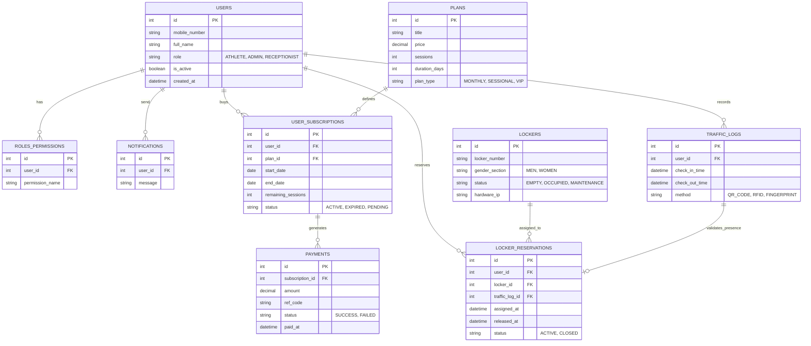

```mermaid
erDiagram
    USERS {
        int id PK
        string mobile_number
        string full_name
        string role "ATHLETE, ADMIN, RECEPTIONIST"
        boolean is_active
        datetime created_at
    }

    ROLES_PERMISSIONS {
        int id PK
        int user_id FK
        string permission_name
    }

    NOTIFICATIONS {
        int id PK
        int user_id FK
        string message
    }

    PLANS {
        int id PK
        string title
        decimal price
        int sessions 
        int duration_days
        string plan_type "MONTHLY, SESSIONAL, VIP"
    }

    USER_SUBSCRIPTIONS {
        int id PK
        int user_id FK
        int plan_id FK
        date start_date
        date end_date
        int remaining_sessions
        string status "ACTIVE, EXPIRED, PENDING"
    }

    PAYMENTS {
        int id PK
        int subscription_id FK
        decimal amount
        string ref_code
        string status "SUCCESS, FAILED"
        datetime paid_at
    }

    TRAFFIC_LOGS {
        int id PK
        int user_id FK
        datetime check_in_time
        datetime check_out_time
        string method "QR_CODE, RFID, FINGERPRINT"
    }

    LOCKERS {
        int id PK
        string locker_number
        string gender_section "MEN, WOMEN"
        string status "EMPTY, OCCUPIED, MAINTENANCE"
        string hardware_ip
    }

    LOCKER_RESERVATIONS {
        int id PK
        int user_id FK
        int locker_id FK
        int traffic_log_id FK
        datetime assigned_at
        datetime released_at
        string status "ACTIVE, CLOSED"
    }

    USERS ||--o{ NOTIFICATIONS : "send"
    USERS ||--o{ ROLES_PERMISSIONS : "has"
    USERS ||--o{ USER_SUBSCRIPTIONS : "buys"
    PLANS ||--o{ USER_SUBSCRIPTIONS : "defines"
    USER_SUBSCRIPTIONS ||--o{ PAYMENTS : "generates"
    USERS ||--o{ TRAFFIC_LOGS : "records"
    USERS ||--o{ LOCKER_RESERVATIONS : "reserves"
    LOCKERS ||--o{ LOCKER_RESERVATIONS : "assigned_to"
    TRAFFIC_LOGS ||--o| LOCKER_RESERVATIONS : "validates_presence"

```
