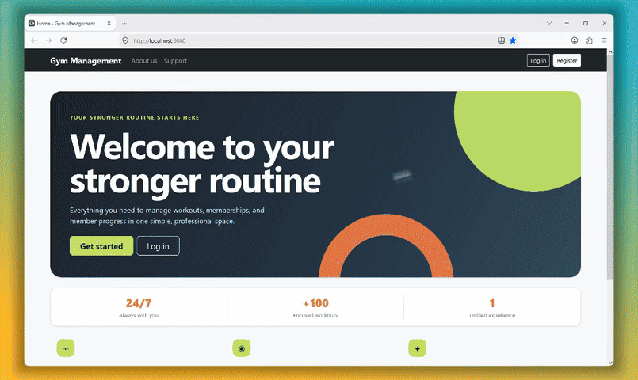
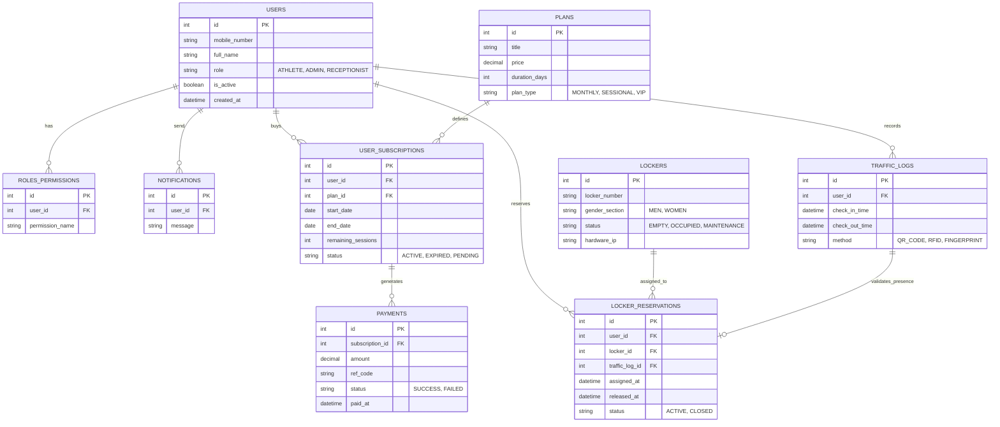

# 🏋️‍♂️ Gym Management Application

<p align="center">
  <strong>A robust, enterprise-ready management system for streamlining gym operations and automated facility workflows.</strong>
</p>

<p align="center">
  
  
  
  
  
  
  
  
  
  
</p>
<br>

<p align="center">
  
</p>

---

## 📌 Overview

A modern gym and sports complex management platform built with **Java 21+** and **Spring Boot 4.x**. 

The system automates the complete operational lifecycle of a gym: member onboarding, subscription packages, online payments, facility entry/exit tracking (QR Code, RFID, Biometrics), smart locker allocations with hardware integration capabilities, and granular role-based security.

### 🧩 Core Domain Model
* 👤 **Users** — Athletes, Admins, and Receptionists with mobile-first authentication.
* 📋 **Plans** — Membership catalog with session limits, day validity, and hybrid constraints.
* 🎫 **Subscriptions** — Active member passes bound to specific plans and usage tracking.
* 💳 **Payments** — Transaction logs tied to subscriptions, tracking payment states and bank ref codes.
* ⏱️ **Traffic Logs** — Automated check-in and check-out logs validating physical facility visits.
* 🔐 **Lockers** — Gender-segregated locker management featuring hardware controller IP mapping.
* 🔑 **Locker Reservations** — Athletes can select and reserve an available locker during their visit, with active and historical assignments tracked.
* 🛡️ **Roles & Permissions** — Dynamic, decoupled permission assignment.

---

## 🗄️ Database ER Diagram

The following Entity-Relationship diagram illustrates the core data structure and relationships within the PostgreSQL database:


---

## 🛠️ Tech Stack

| Technology | Role / Usage |
| :--- | :--- |
| **Java 21+** | Core programming language leveraging modern features (Records, Sealed Types) |
| **Spring Boot 4.x** | Core application framework & dependency injection engine |
| **Spring Data JPA** | Data access abstraction and dynamic query generation |
| **Spring Security** | Role-based authorization, custom user details authentication, and endpoint filters |
| **Hibernate ORM** | Object-Relational Mapping, lifecycle callbacks, and schema management |
| **PostgreSQL** | High-performance relational database storage |
| **Thymeleaf** | Server-Side Rendering (SSR) templating engine with modular layout architecture |
| **Bootstrap 5** | Fully responsive layout supporting right-to-left UI directionality |
| **MapStruct** | Compile-time type-safe Bean mappings between JPA Entities and Request/Response DTOs |
| **Lombok** | Boilerplate reduction for entity models and logging |
| **Jakarta Validation** | Declarative request payload verification and regex pattern validation |
| **Maven** | Dependency management, build automation, and code generation pipelines |

---

## 🏗️ Architecture & Project Structure

The project strictly follows a layered architectural design pattern:

```text
src/main/java/com/gym/management
│
├── controller           # Web MVC & REST endpoints handling incoming requests
│   └── advice           # Global exception handler & centralized error processing
├── dto                  # Data Transfer Objects
│   ├── request          # Validated payloads received from forms/clients
│   └── response         # Structured views returned to templates or APIs
├── entity               # Persistent JPA entities inheriting BaseEntity auditing
│   └── enums            # Strongly typed domain constants (Role, Status, Method)
├── mapper               # MapStruct interfaces generating mapper implementations
├── repository           # Spring Data JPA repositories with query conventions
├── security             # UserDetailsService, password encoders, and WebSecurityConfig
└── service              # Business logic transactions, operations, and rule validations
```

```text
src/main/resources
│
├── static               # Static assets (Custom app.css, app.js, Bootstrap RTL)
│   ├── css/
│   └── js/
└── templates            # Thymeleaf templates and layouts
    ├── admin/           # Administrative consoles (Lockers, Plans, Users)
    ├── dashboard/       # Athlete portals (Purchases, Subscriptions, Traffic)
    ├── fragments/       # Reusable components (Navbars, Footer)
    └── layout/          # Base template wrappers (Public, Auth, Dashboard, Admin)
```

---

## 🗺️ Application Routes & Page Directory

The interface is divided into three functional domains: **Public**, **Athlete Dashboard**, and **Administrative Panel**.

### 🌐 Public & Authentication Endpoints
| Route | Method | Access Level | Description |
| :--- | :---: | :---: | :--- |
| `/` or `/home` | `GET` | Public | Landing page showcasing gym facilities, plans, and contact details |
| `/login` | `GET` / `POST` | Public | Mobile-number-based credential authentication |
| `/register` | `GET` / `POST` | Public | Member onboarding registration form |
| `/error` / `/403` | `GET` | Public | Standard fallback and access denial pages |

### 🏋️ Athlete Dashboard (`/dashboard/*`)
| Route | Method | Access Level | Description |
| :--- | :---: | :---: | :--- |
| `/dashboard/my-subscriptions` | `GET` | Athlete | View active subscriptions, validity periods, and remaining sessions |
| `/dashboard/buy-plan` | `GET` / `POST` | Athlete | Browse membership plans and initiate direct online purchases |
| `/dashboard/traffic-logs` | `GET` | Athlete | Full personal entry/exit log and attendance history |
| `/dashboard/traffic-log/check-in` | `GET` / `POST` | Athlete | Self check-in terminal scanning QR codes |
| `/dashboard/traffic-log/check-out` | `GET` / `POST` | Athlete | Facility check-out terminal and locker release trigger |
| `/dashboard/lockers` | `GET` | Athlete | View assigned locker details during ongoing visits |

### 🛠️ Administration Panel (`/admin/*`)
| Route | Method | Access Level | Description |
| :--- | :---: | :---: | :--- |
| `/admin/panel` | `GET` | Admin / Receptionist | Main operational overview and gym metric dashboard |
| `/admin/plans` | `GET` | Admin | Membership plan inventory and active package pricing |
| `/admin/plans/new` | `GET` / `POST` | Admin | Create or edit membership packages (`PlanCreateRequest`) |
| `/admin/users` | `GET` | Admin / Receptionist | Member search, account activation toggles, and role assignments |
| `/admin/users/new` | `GET` / `POST` | Admin | Staff-assisted registration for new gym members |
| `/admin/lockers` | `GET` | Admin / Receptionist | Real-time locker matrix (Empty, Occupied, Maintenance) |
| `/admin/lockers/new` | `GET` / `POST` | Admin | Register new lockers with hardware IP mapping |

---

## ⚖️ Business Rules & Implementation Logic

### 👤 Identity & Access Control
* **Mobile-Centric Login:** Mobile number (`09xxxxxxxxx`, validated by `^09\d{9}$`) serves as the unique identifier (`username`).
* **Active Status Verification:** Inactive users (`isActive = false`) are automatically blocked during authentication by `CustomUserDetailsService`.
* **Auditing Guarantee:** Every table records `createdAt` and `updatedAt` timestamps automatically via `@EnableJpaAuditing` and Spring Data's `AuditingEntityListener`.

### 📋 Membership & Subscription Lifecycle
* **Plan Flexibility:** Supports `SESSION_BASED`, `TIME_BASED`, and `HYBRID` models.
* **Duration Constraints:** Plans require positive price amounts and a defined duration in days.
* **Session Tracking:** Subscriptions deduct sessions upon valid gym check-in; time-based plans expire based on `endDate`.

### 🚪 Automated Traffic & Access Control
* **Multi-Modal Verification:** Access logs record the hardware entry method:
  * `QR_CODE`: Dynamic terminal scanning via mobile.
  * `RFID`: Proximity card scanner input.
  * `FINGERPRINT`: Biometric turnstile integration.
* **Visit State:** Prevents simultaneous duplicate entries if a user has not logged a check-out time.

### 🔐 Facility & Smart Locker Management
* **Gender Separation:** Lockers are categorized by `MEN` or `WOMEN` changing rooms (`GenderSection`).
* **Hardware Interoperability:** Each locker can store a `hardwareIp` address for integration with network-attached electric strikes / relays.
* **Reservation Lifecycle:** Lockers transition dynamically across `EMPTY`, `OCCUPIED`, and `MAINTENANCE` statuses.

---

## 🚀 Getting Started

### Prerequisites
* **Java Development Kit (JDK):** Version 17 or higher
* **Relational Database:** PostgreSQL 14+
* **Build System:** Maven 3.9+ (or use the packaged `./mvnw`)

### 🗄️ Database Setup & Configuration

1. Create a dedicated database in your PostgreSQL instance:
   ```sql
   CREATE DATABASE gym_db;
   ```

2. Configure application environment variables. You can provide these through your system environment, an external `.env` file, or by updating `src/main/resources/application.properties`:

   ```properties
   spring.datasource.url=jdbc:postgresql://localhost:5432/gym_db
   spring.datasource.username=postgres
   spring.datasource.password=your_secure_password
   spring.jpa.hibernate.ddl-auto=update
   spring.jpa.show-sql=false
   ```

### 🏃 Building & Running

* **Windows (PowerShell):**
  ```powershell
  .\mvnw.cmd clean spring-boot:run
  ```

* **Linux / macOS:**
  ```bash
  chmod +x mvnw
  ./mvnw clean spring-boot:run
  ```

Once launched, access the application in your browser:
* **Home Page:** [http://localhost:8080](http://localhost:8080)
* **Login:** [http://localhost:8080/login](http://localhost:8080/login)
* **Admin Console:** [http://localhost:8080/admin/panel](http://localhost:8080/admin/panel)

---

## 📈 Roadmap & Future Improvements

- [ ] Complete RESTful API controllers with JWT bearer authentication for companion mobile apps.
- [ ] Direct payment gateway driver integration (Zarinpal / Shetab IPG).
- [ ] MQTT / Socket client driver for physical turnstile and smart locker relay controllers.
- [ ] Scheduled background tasks (`@Scheduled`) for automated expiration of subscriptions.

---

## 📄 License

This project is open-source and licensed under the **MIT License**. See the `LICENSE` file for details.
